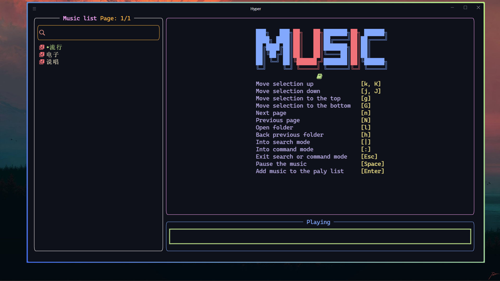
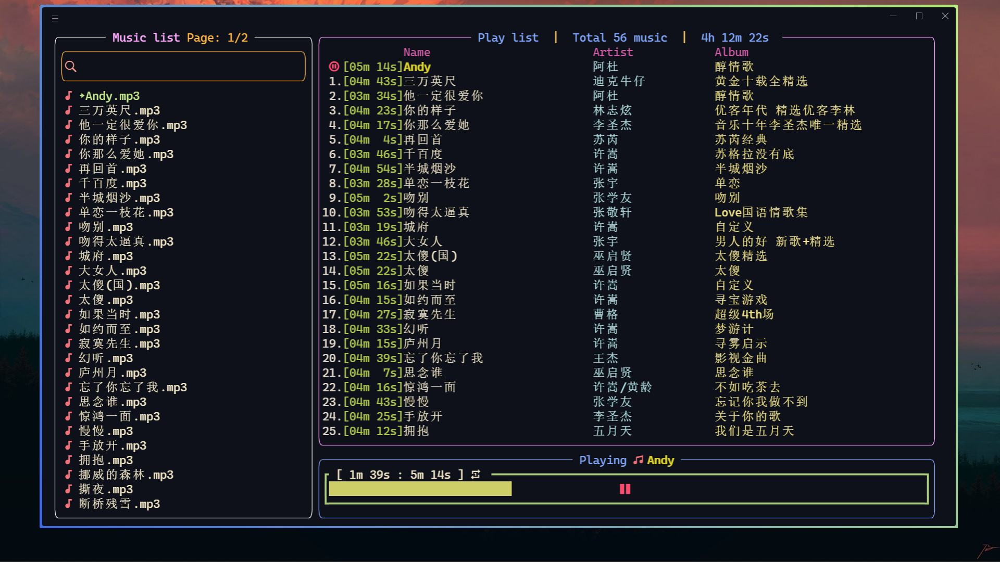

# A terminal music player written in the Rust language.




## Requirements
配置文件存放在: 用户目录\\.config\music_player\config.yml

Configuration file path: ~\\.config\music_player\config.yml

```yml
# Path to store music
# 存放音乐的路径
music_database: ''

# Color
# 主题配色
theme:
  list_title_color: '#ffaaff'
  list_title_page_color: '#ffb747'
  list_border_color: '#ffffff'
  list_music_color: '#eee4c4'
  list_folder_color: '#eee4c4'
  list_icon_color: '#f07178'
  list_selected_color: '#c3e88d'
  search_border_color: '#ffb747'
  search_icon_color: '#ec998b'
  search_font_color: '#eee4c4'
  command_font_color: '#eee4c4'
  command_border_color: '#c3eead'
  music_pic_color1: '#f07178'
  music_pic_color2: '#81a8fd'
  usage_color_left: '#beb2ec'
  usage_color_right: '#eee188'
  cut_off_rule_color: '#c3e88d'
  play_music_list_title_color: '#81a8fd'
  play_music_list_border_color: '#ffaaff'
  play_music_list_id_color: '#e0d7ca'
  play_music_list_duration_color: '#a9c34f'
  play_music_list_name_color: '#eee4c4'
  play_music_list_artist_color: '#b2e2e4'
  play_music_list_album_color: '#eee188'
  play_music_list_header_color: '#d15aa7'
  playing_music_border_color: '#81a8fd'
  playing_music_name_color: '#d8ce2e'
  volume_icon_color: '#9998af'
  volume_value_color: '#dcd8da'
  gauge_color: '#cece68'
  gauge_border_color: '#abcc7e'
  gauge_label_color: '#fa4d70'
```

## Usage

### Browse

| Description                  | Event                  |
| ---------------------------- | ---------------------- |
| Exit program                 | q                      |
| Move selection down          | j \| \<Down Arrow Key> |
| Move selection up            | k \| \<Up Arrow Key>   |
| Move selection down 5 steps  | J                      |
| Move selection up 5 steps    | K                      |
| Move selection to the top    | g                      |
| Move selection to the bottom | G                      |
| Next page                    | n                      |
| Previous page                | N                      |
| Open folder                  | l                      |
| Back to the previous folder  | h                      |
| Enter command mode           | :                      |
| Enter search mode            | \|                     |
| Exit search or command mode  | \<Esc>                 |
| Pause or resume              | \<Space>               |
| Increase the volume          | + \| =                 |
| Decrease the volume          | -                      |
| Add music to the playlist    | \<Enter>               |

### Command

| Description                                                               | Command           |
| ------------------------------------------------------------------------- | ----------------- |
| Add all songs in the current directory to the playlist                    | all               |
| Removes the specified song from the playlist (Multiple can be specified)  | rm \<music_id>    |
| Remove all songs from the playlist                                        | clear \| cls      |
| Play the whole playlist (Repeat: on)                                      | order \| od       |
| Put the current song on repeat (Repeat: off)                              | singlecycle \| sc |
| Shuffle current playlist | shuffle \| sh |
| Play the next song in the playlist                                        | next \| n         |